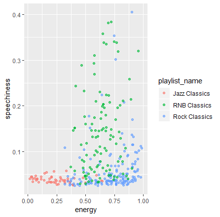

```{r setup, include=FALSE}
library(flexdashboard)
```

```{r}
library(tidyverse)
library(spotifyr)
source('spotify.R')
library(knitr)
library(ggplot2)
```

Introduction
=====================================
Column
-----------------------------------------------------------------------

### Research question
 
What features are important for assigning a song to a specific genre?

Column
-----------------------------------------------------------------------


Data
=====================================

Column  {data-width = 1000}
-----------------------------------------------------------------------
### Overview

```{r}
jazz <- get_playlist_audio_features('', '37i9dQZF1DXbITWG1ZJKYt')
rock <- get_playlist_audio_features('', '37i9dQZF1DWXRqgorJj26U')
rnb <- get_playlist_audio_features('113193753', '1rLuENR0J3kQ2DNXJ0bp6x')
```


Spotify playlists:

* Jazz Classics (50 songs)
* Rock classics (150 songs)
* RNB Classics (70 songs)

```{r echo = FALSE}
#all_music <- rbind(jazz, rock, rnb)
jazz_features <- jazz[, c("danceability", "energy", "key", "loudness", "mode", "speechiness", "acousticness", "instrumentalness", "liveness", "valence", "tempo", "time_signature", "key_mode")]

rock_features <- rock[, c("danceability", "energy", "key", "loudness", "mode", "speechiness", "acousticness", "instrumentalness", "liveness", "valence", "tempo", "time_signature", "key_mode")]

rnb_features <- rnb[, c("danceability", "energy", "key", "loudness", "mode", "speechiness", "acousticness", "instrumentalness", "liveness", "valence", "tempo", "time_signature", "key_mode")]

num_jazz <- jazz_features[, c("danceability", "energy", "loudness", "speechiness", "acousticness", "instrumentalness", "liveness", "valence", "tempo")]

num_rock <- rock_features[, c("danceability", "energy", "loudness", "speechiness", "acousticness", "instrumentalness", "liveness", "valence", "tempo")]

num_rnb <- rnb_features[, c("danceability", "energy", "loudness", "speechiness", "acousticness", "instrumentalness", "liveness", "valence", "tempo")]

jazz_means <- colMeans(num_jazz)

rock_means <- colMeans(num_rock)

rnb_means <- colMeans(num_rnb)

means <- rbind(jazz_means, rock_means, rnb_means)

kable(means, format='markdown')
```


Visualizations
=====================================

Column {.tabset}
-----------------------------------------------------------------------

### Dotplot


### Boxplot Jazz

```{r echo = FALSE}
ggplot(stack(num_jazz), aes(x = factor(ind, levels = names(num_jazz)), y = values)) + geom_boxplot()
```

### Boxplot Rock

```{r echo = FALSE}
ggplot(stack(num_rock), aes(x = factor(ind, levels = names(num_rock)), y = values)) + geom_boxplot()
```

### Boxplot Rnb

```{r echo = FALSE}
ggplot(stack(num_rnb), aes(x = factor(ind, levels = names(num_rnb)), y = values)) + geom_boxplot()
```