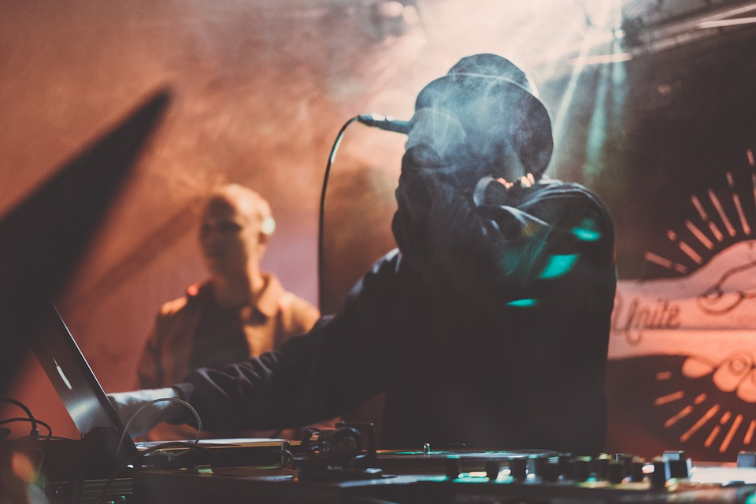
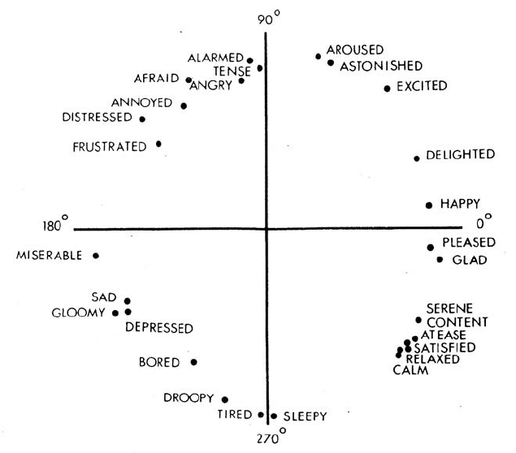

```{r setup, include=FALSE}
library(flexdashboard)
```


```{R}
library(tidyverse)
library(compmus)
library(spotifyr)
source('spotify.R')
library(knitr)
library(ggplot2)
library(plotly)
library(shiny)
require(gridExtra)
library(tidymodels)
library(ggdendro)
library(protoclust)
library(heatmaply)
set.seed(5)
```

Intro {data-orientation=rows}
===================================== 
    
### Nederhop versus American Hip Hop Music
    
Hip hop is said to be invented by the Jamaican Kool DJ Herc in 1973 in New York's Bronx (Blanchard, 1999). He used an new turntable technique to stretch a song's drum break (Blanchard, 1999). Rap, the lyrics of the music came up when DJ's were playing at a hip hop event and people started to comment on the abilities of the DJ (Blanchard, 1999). Hip hop as both a musical genre and a culture reached different parts of the world. In the Netherlands this resulted in the genre Nederhop. It was adapted to the Dutch market, especially by using the Dutch language. Nederhop is highly influenced by American hip hop. Both Dutch and American hip hop music are embedded in a different culture, which makes it interesting to research how they differ from each other. In this study the Spotify Developer toolkit is used to analyse both musical styles. This resulted in the following research question: 

**How does Nederhop compare to American hip hop in terms of their Spotify features?**

Koreman (2014) found that authenticity is one of the main criteria by which hip hop music is judged in the media. Though, the meaning of authenticity is not always the same. In music reviews in the US, authenticity is all about 'keeping it real' and remaining true to your roots. In the Netherlands on the other hand, authentic means being true to yourself. Where American rappers are expected to stay within the genre, in Nederhop experimentation is valued, allowing artists to mix hip hop with pop and reggae for example. This flexibility within Nederhop as a genre, might be visible in the Spotify features that are going to be analysed. It could result in a bigger spread of the data.


References:

Blanchard, B. (1999). The social significance of rap & hip-hop culture. Journal of Poverty & Prejudice, Spring.

Koreman, R. (2014). Legitimating Local Music: Volksmuziek, Hip-Hop/Rap and Dance Music in Dutch Elite Newspapers. Cultural Sociology, 8(4), 501-519.

    
### .



   
Corpus {data-orientation=rows}
=====================================     

Column {data-height=200}
-------------------------------------

### Corpus Selection
    
For this research project, I selected 7 Dutch and 7 American hip hop artists. Besides comparing the two genres, this enables us to look at the characteristics of each individual artist.  For each artist Spotify has created a 'This is ...' playlist with around 50 songs. I noticed a lot of collaboration between artists. This might result in songs appearing in multiple playlists, which might have a misleading effect. To be able to do a good comparison, I decided to select only the songs by the artist himself. I hope this gives a good representation of the style and properties of the artists. After making this selection,  the playlists differed a lot in size, but I accepted this because the number of songs for the dutch and american genre were almost the same.  This analysis is focussed on relatively new hip hop, with songs uploaded from 2017 till now.

Column {data-height=800}
-------------------------------------

### Spotify Playlists: Nederhop

|Artist         |Spotify Playlist       |Spotify URI’s|
|---------:     |---------:             |---------:|
|Boef	          |This Is Boef	          |spotify:user:spotify:playlist:37i9dQZF1DWWJCm1k4bHxN|
|Lil’ Kleine	  |This Is Lil’ Kleine	  |spotify:user:spotify:playlist:37i9dQZF1DX7ZXeE7FXyuv|
|Ronnie Flex	  |This Is Ronnie Flex	  |spotify:user:spotify:playlist:37i9dQZF1DWUnYvKDFOuQS|
|Bizzey	        |This Is Bizzey	        |spotify:user:spotify:playlist:37i9dQZF1DZ06evO3lKLEk|
|Frenna	        |This Is Frenna	        |spotify:user:spotify:playlist:37i9dQZF1DZ06evO3KC2M8|
|Broederliefde	|This Is: Broederliefde	|spotify:user:spotify:playlist:37i9dQZF1DX1crj0pJiTEg|
|Josylvio	      |This is Josylvio	      |spotify:user:spotify:playlist:37i9dQZF1DX8ayR1CI5YND|

### Spotify Playlists: American hip hop

|Artist	        |Spotify Playlist	      |Spotify URI’s|
|---------:     |---------:             |---------:|
|Wiz Khalifa	  |This Is Wiz Khalifa    |spotify:user:spotify:playlist:37i9dQZF1DWXwWInfdJ5vk|
|Kanye West	    |This Is Kanye West	    |spotify:user:spotify:playlist:37i9dQZF1DX7qQG2hCGiwy|
|Kendrick Lamar	|This Is Kendrick Lamar	|spotify:user:spotify:playlist:37i9dQZF1DX5EkyRFIV92g|
|Drake	        |This Is Drake	        |spotify:user:spotify:playlist:37i9dQZF1DX7QOv5kjbU68|
|DJ Khaled	    |This Is DJ Khaled	    |spotify:user:spotify:playlist:37i9dQZF1DZ06evO0rer1m|
|Snoop Dogg	    |This Is Snoop Dogg	    |spotify:user:spotify:playlist:37i9dQZF1DZ06evO4jkBCE|
|Nicki Minaj	  |This Is Nicki Minaj	  |spotify:user:spotify:playlist:37i9dQZF1DXcdgOcuyZbSA|


Statistics
=====================================

```{r}
# Load all Dutch music
boef <- get_playlist_audio_features("spotify", "37i9dQZF1DWWJCm1k4bHxN")
boef <- boef %>% filter(artist_name == "Boef")
#boef <- sample_n(boef, 23)

lilkleine <- get_playlist_audio_features("spotify", "37i9dQZF1DX7ZXeE7FXyuv")
lilkleine <- lilkleine %>% filter(artist_name == "Lil' Kleine")
#lilkleine <- sample_n(lilkleine, 23)

ronnie <- get_playlist_audio_features("spotify", "37i9dQZF1DWUnYvKDFOuQS")
ronnie <- ronnie %>% filter(artist_name == "Ronnie Flex")
#ronnie <- sample_n(ronnie, 23)

bizzey <- get_playlist_audio_features("spotify", "37i9dQZF1DZ06evO3lKLEk")
bizzey <- bizzey %>% filter(artist_name == "Bizzey")

frenna <- get_playlist_audio_features("spotify", "37i9dQZF1DZ06evO3KC2M8")
frenna <- frenna %>% filter(artist_name == "Frenna")
#frenna <- sample_n(frenna, 23)

broederliefde <- get_playlist_audio_features("spotify", "37i9dQZF1DX1crj0pJiTEg")
broederliefde <- broederliefde %>% filter(artist_name == "Broederliefde")
#broederliefde <- sample_n(broederliefde, 23)

josylvio <- get_playlist_audio_features("spotify", "37i9dQZF1DX8ayR1CI5YND")
josylvio <- josylvio %>% filter(artist_name == "Josylvio")
#josylvio <- sample_n(josylvio, 23)


nederhop <- rbind(boef, lilkleine, ronnie, bizzey, frenna, broederliefde, josylvio)
nederhop$genre <- "Nederhop"

# Load all American music

wiz <- get_playlist_audio_features("spotify", "37i9dQZF1DWXwWInfdJ5vk")
wiz <- wiz %>% filter(artist_name == "Wiz Khalifa")
wiz <- sample_n(wiz, 23)

kanye <- get_playlist_audio_features("spotify", "37i9dQZF1DX7qQG2hCGiwy")
kanye <- kanye %>% filter(artist_name == "Kanye West")
kanye <- sample_n(kanye, 23)

kendrick <- get_playlist_audio_features("spotify", "37i9dQZF1DX5EkyRFIV92g")
kendrick <- kendrick %>% filter(artist_name == "Kendrick Lamar")
kendrick <- sample_n(kendrick, 23)

drake <- get_playlist_audio_features("spotify", "37i9dQZF1DX7QOv5kjbU68")
drake <- drake %>% filter(artist_name == "Drake")
#drake <- sample_n(drake, 23)

khaled <- get_playlist_audio_features("spotify", "37i9dQZF1DZ06evO0rer1m")
khaled <- khaled %>% filter(artist_name == "DJ Khaled")
#khaled <- sample_n(khaled, 23)

snoop <- get_playlist_audio_features("spotify", "37i9dQZF1DZ06evO4jkBCE")
snoop <- snoop %>% filter(artist_name == "Snoop Dogg")

nicki <- get_playlist_audio_features("spotify", "37i9dQZF1DXcdgOcuyZbSA")
nicki <- nicki %>% filter(artist_name == "Nicki Minaj")
#nicki <- sample_n(nicki, 23)

american_hiphop <- rbind(wiz, kanye, kendrick, drake, khaled, snoop, nicki)
american_hiphop$genre <- "American hip hop"

corpus <- rbind(nederhop, american_hiphop)
```

Column {data-width=700}
-------------------------------------

### First look at the data
```{r}
numeric_nederhop <- nederhop[, c("danceability", "energy", "loudness", "speechiness", "acousticness", "instrumentalness", "liveness", "valence", "tempo")]

numeric_american <- american_hiphop[, c("danceability", "energy", "loudness", "speechiness", "acousticness", "instrumentalness", "liveness", "valence", "tempo")]

mean_nederhop <- colMeans(numeric_nederhop)
sd_nederhop <- sapply(numeric_nederhop, sd, na.rm = TRUE)

mean_american <- colMeans(numeric_american)
sd_american <- sapply(numeric_american, sd, na.rm = TRUE)

mean_sd <- data.frame(mean_nederhop, sd_nederhop, mean_american, sd_american)
knitr::kable(mean_sd)
```

Column {data-width=300}
-------------------------------------

### Findings
These are the means and standard deviations for the numeric features. The featue values for American and Dutch hip hop are alike. It can be noticed that the standard deviations for the Dutch hip hop are smaller. This was surprising, because in the literature, Nederhop seemed to be a broader genre.


Emotions
=====================================

Column {.tabset .tabset-fade data-width=600}
-------------------------------------
   
### Dutch versus American

```{r}
energy_valence <- ggplot(corpus, aes(x=valence, y=energy, color=genre, label = artist_name, label2 = track_name)) + geom_point(shape = 21)
ggplotly(energy_valence)
```  
 
### Dutch artists

```{r}
energy_valence_artist_nl <- ggplot(nederhop, aes(x=valence, y=energy, color=artist_name, label = artist_name, label2 = track_name)) + geom_point(shape = 21)
ggplotly(energy_valence_artist_nl)
```  

### American artists

```{r}
energy_valence_artist_us <- ggplot(american_hiphop, aes(x=valence, y=energy, color=artist_name, label = artist_name, label2 = track_name)) + geom_point(shape = 21)
ggplotly(energy_valence_artist_us)
``` 

Column {data-width=400}
-------------------------------------

### Russell's circumplex model

{width=400}


Emotion studies in HCI-a new approach - Scientific Figure on ResearchGate. Available from: https://www.researchgate.net/figure/Russells-circumplex-model-of-affect_fig1_229021134 [accessed 19 Mar, 2019]

### Findings

On the left we see the data points in an enery valence space. This space can be linked to different emotions. Above, Russell's circumplex model is displayed. In this model, the vertical axis represents arousal, which for now we consider comparable with energy. The horizontal axis represents valence. The middle represents medium valence and medium arousal.

Most data appears in the top half. This makes sense, considering hip hop is more happy or angry than relaxed or sad. American hip hop appears in the sad section more often. When looking at artists individually, we don't see any clear clusters.


Danceability
=====================================

Column {.tabset .tabset-fade data-width=600}
-------------------------------------
   
### Dutch versus American

```{r}
loudness_danceability <- ggplot(corpus, aes(x=acousticness, y=danceability, color=genre, label = artist_name, label2 = track_name)) + geom_point(shape = 21)
ggplotly(loudness_danceability)
```  
 
### Dutch artists

```{r}
loudness_danceability_artist_nl <- ggplot(nederhop, aes(x=acousticness, y=danceability, color=artist_name, label = artist_name, label2 = track_name)) + geom_point(shape = 21)
ggplotly(loudness_danceability_artist_nl)
```  

### American artists

```{r}
loudness_danceability_artist_us <- ggplot(american_hiphop, aes(x=acousticness, y=danceability, color=artist_name, label = artist_name, label2 = track_name)) + geom_point(shape = 21)
ggplotly(loudness_danceability_artist_us)
``` 

Column {data-width=400}
-------------------------------------

### Findings

To define the danceability of a song, Spotify considers tempo, rhythm stability, beat strength, and overall regularity. As hip hop is a huge dance culture, it is expected that the songs are often very danceable. This is visible in the data. I didn't think acoustic hip hop was very plausible, so I expected to find some outliers. I don't think we should consider "Grand Piano" by Nicki Minaj hip hop, but I do think "Lust For Life" by Drake is a great example that acoustic hip hop is possible.


Song structure
=====================================

Column {.tabset .tabset-fade data-width=700}
-------------------------------------
### "Gemaakt voor dit" by Lil' Kleine
```{r}
gemaakt_voor_dit <- 
    get_tidy_audio_analysis('1wOLYsMBvJ2NOYSudRMTSo') %>% 
    compmus_align(bars, segments) %>% 
    select(bars) %>% unnest(bars) %>% 
    mutate(
        pitches = 
            map(segments, 
                compmus_summarise, pitches, 
                method = 'rms', norm = 'euclidean')) %>% 
    mutate(
        timbre = 
            map(segments, 
                compmus_summarise, timbre, 
                method = 'mean'))

gemaakt_voor_dit_timbre <- gemaakt_voor_dit %>% 
    compmus_self_similarity(timbre, 'cosine') %>% 
    ggplot(
        aes(
            x = xstart + xduration / 2, 
            width = xduration,
            y = ystart + yduration / 2,
            height = yduration,
            fill = d)) + 
    geom_tile() +
    coord_fixed() +
    scale_fill_viridis_c(option = 'E', guide = 'none') +
    theme_classic() +
    labs(x = '', y = '')

gemaakt_voor_dit_chroma <- gemaakt_voor_dit %>% 
    compmus_self_similarity(pitches, 'cosine') %>% 
    ggplot(
        aes(
            x = xstart + xduration / 2, 
            width = xduration,
            y = ystart + yduration / 2,
            height = yduration,
            fill = d)) + 
    geom_tile() +
    coord_fixed() +
    scale_fill_viridis_c(option = 'E', guide = 'none') +
    theme_classic() +
    labs(x = '', y = '')

grid.arrange(gemaakt_voor_dit_timbre, gemaakt_voor_dit_chroma, ncol=2, heights=c(1,1), top = "Timbre-based vs Chroma-based Self-Similarity matrix")
```

### "Signs" by Snoop Dogg
```{r}
signs <- 
    get_tidy_audio_analysis('2Sionb7ZAmdVGH9mieuJ7Z') %>% 
    compmus_align(bars, segments) %>% 
    select(bars) %>% unnest(bars) %>% 
    mutate(
        pitches = 
            map(segments, 
                compmus_summarise, pitches, 
                method = 'rms', norm = 'euclidean')) %>% 
    mutate(
        timbre = 
            map(segments, 
                compmus_summarise, timbre, 
                method = 'mean'))

signs_timbre <- signs %>% 
    compmus_self_similarity(timbre, 'cosine') %>% 
    ggplot(
        aes(
            x = xstart + xduration / 2, 
            width = xduration,
            y = ystart + yduration / 2,
            height = yduration,
            fill = d)) + 
    geom_tile() +
    coord_fixed() +
    scale_fill_viridis_c(option = 'E', guide = 'none') +
    theme_classic() +
    labs(x = '', y = '')

signs_chroma <- signs %>% 
    compmus_self_similarity(pitches, 'cosine') %>% 
    ggplot(
        aes(
            x = xstart + xduration / 2, 
            width = xduration,
            y = ystart + yduration / 2,
            height = yduration,
            fill = d)) + 
    geom_tile() +
    coord_fixed() +
    scale_fill_viridis_c(option = 'E', guide = 'none') +
    theme_classic() +
    labs(x = '', y = '')

grid.arrange(signs_timbre, signs_chroma, ncol=2, heights=c(1,1), top = "Timbre-based vs Chroma-based Self-Similarity matrices")
```

Column {data-width=300}
-------------------------------------
### Findings
In the previous page we looked at the danceability of songs. Although danceability is not a very straight forward feature, I want to look for other things that might indicate the dancebility of songs. I selected "Gemaakt voor dit" by Lil' Kleine and "Signs" by Snoop Dogg, because they are extremely danceable according to Spotify. After listening to the songs, I must say I agree. 

For each song, the left self-similarity matrix is based on timbre, and the right one is based on chroma. The features were summarised at bar level and the axes are in seconds. 

In the matrices, we see a checkerboard structure. These blocks represent homogeneous regions in the songs. The diagonal lines, parallel to the main diagnal represent exact repetions in the music. Both songs show a lot of repitions, which makes sense. To make it easy to dance to a song, I think the song should be predictable and that can be accomplished by repetition. The chroma and timbre patterns for "Gemaakt voor dit" seem to fit nicely on top of each other, showing that homogeneous regions in chroma correspond to homogenious regions in timbre.

Keygram
=====================================
Column {data-width=700}
-------------------------------------
### HUMBLE. by Kendrick Lamar

```{R}
circshift <- function(v, n) {if (n == 0) v else c(tail(v, n), head(v, -n))}
                                    
    # C     C#    D     Eb    E     F     F#    G     Ab    A     Bb    B 
major_chord <- 
    c(1,    0,    0,    0,    1,    0,    0,    1,    0,    0,    0,    0)
minor_chord <- 
    c(1,    0,    0,    1,    0,    0,    0,    1,    0,    0,    0,    0)
seventh_chord <- 
    c(1,    0,    0,    0,    1,    0,    0,    1,    0,    0,    1,    0)

major_key <- 
    c(6.35, 2.23, 3.48, 2.33, 4.38, 4.09, 2.52, 5.19, 2.39, 3.66, 2.29, 2.88)
minor_key <-
    c(6.33, 2.68, 3.52, 5.38, 2.60, 3.53, 2.54, 4.75, 3.98, 2.69, 3.34, 3.17)

key_templates <-
    tribble(
        ~name    , ~template,
        'Gb:maj', circshift(major_key,  6),
        'Bb:min', circshift(minor_key, 10),
        'Db:maj', circshift(major_key,  1),
        'F:min' , circshift(minor_key,  5),
        'Ab:maj', circshift(major_key,  8),
        'C:min' , circshift(minor_key,  0),
        'Eb:maj', circshift(major_key,  3),
        'G:min' , circshift(minor_key,  7),
        'Bb:maj', circshift(major_key, 10),
        'D:min' , circshift(minor_key,  2),
        'F:maj' , circshift(major_key,  5),
        'A:min' , circshift(minor_key,  9),
        'C:maj' , circshift(major_key,  0),
        'E:min' , circshift(minor_key,  4),
        'G:maj' , circshift(major_key,  7),
        'B:min' , circshift(minor_key, 11),
        'D:maj' , circshift(major_key,  2),
        'F#:min', circshift(minor_key,  6),
        'A:maj' , circshift(major_key,  9),
        'C#:min', circshift(minor_key,  1),
        'E:maj' , circshift(major_key,  4),
        'G#:min', circshift(minor_key,  8),
        'B:maj' , circshift(major_key, 11),
        'D#:min', circshift(minor_key,  3))
```

```{R}
humble <- 
    get_tidy_audio_analysis('7KXjTSCq5nL1LoYtL7XAwS') %>% 
    compmus_align(sections, segments) %>% 
    select(sections) %>% unnest(sections) %>% 
    mutate(
        pitches = 
            map(segments, 
                compmus_summarise, pitches, 
                method = 'mean', norm = 'manhattan'))

humble %>% 
    compmus_match_pitch_template(key_templates, 'euclidean', 'manhattan') %>% 
    ggplot(
        aes(x = start + duration / 2, width = duration, y = name, fill = d)) +
    geom_tile() +
    scale_fill_viridis_c(option = 'E', guide = 'none') +
    theme_minimal() +
    labs(x = 'Time (s)', y = '')
```


Column {data-width=300}
-------------------------------------
### Findings


Clustering
=====================================
Column {.tabset .tabset-fade data-width=800}
-------------------------------------
### Hierarchical Clustering
```{R}
cluster_corpus <- rbind(sample_n(nederhop, 30), sample_n(american_hiphop, 30))
cluster_data <- cluster_corpus %>% add_audio_analysis %>% 
    mutate(
        segments = 
            map2(segments, key, compmus_c_transpose)) %>% 
    mutate(
        pitches = 
            map(segments, 
                compmus_summarise, pitches, 
                method = 'mean', norm = 'manhattan'),
        timbre =
            map(
                segments,
                compmus_summarise, timbre,
                method = 'mean')) %>% 
    mutate(pitches = map(pitches, compmus_normalise, 'clr')) %>% 
    mutate_at(vars(pitches, timbre), map, bind_rows) %>% 
    unnest(pitches, timbre)
```


```{r}
corpus_juice <- 
    recipe(track_name ~
               danceability +
               energy +
               loudness +
               speechiness +
               acousticness +
               instrumentalness +
               liveness +
               valence +
               tempo +
               duration_ms +
               C + `C#|Db` + D + `D#|Eb` +
               E + `F` + `F#|Gb` + G +
               `G#|Ab` + A + `A#|Bb` + B +
               c01 + c02 + c03 + c04 + c05 + c06 +
               c07 + c08 + c09 + c10 + c11 + c12,
           data = cluster_data) %>% 
    step_center(all_predictors()) %>%
    step_scale(all_predictors()) %>%
    # step_range(all_predictors()) %>% 
    prep(cluster_data %>% mutate(track_name = str_trunc(track_name, 20))) %>% 
    juice %>% 
    column_to_rownames('track_name')
```

```{r}
data_dist <- dist(corpus_juice, method = 'euclidean')
protoclust(data_dist) %>% dendro_data %>% ggdendrogram
```

### Heat map
```{r}
heatmaply(
    corpus_juice,
    #hclustfun = hclust,
    hclustfun = protoclust,
    # Comment out the hclust_method line when using protoclust.
    protoclust_method = 'average',
    dist_method = 'euclidean')
```

Column {data-width=200}
-------------------------------------
### Notes
I randomly selected 30 dutch songs and 30 american songs to perform machine learing on. To the left, we see an hierarchical clustering for the data. In the clusters on the left we see mostly american songs and in the cluster on the right we see mostly dutch songs. In the middle it is mixed.

The heatmap shows the intensity in which the features contributed to the clustering. As the clusters are all in the blue region, it is hard to point out features that are most responsible. Instrumentalness was apparantly very important for the song 'Heard Em Say', assiging it to a cluster of its own.

Classification
=====================================

Column {.tabset .tabset-fade data-width=800}
-------------------------------------

### Random Forest Classifier
```{r}
hiphop <- 
    rbind(sample_n(nederhop, 75), sample_n(american_hiphop, 75)) %>% add_audio_analysis %>% 
    mutate(genre = factor(genre)) %>% 
    mutate(
        segments = 
            map2(segments, key, compmus_c_transpose)) %>% 
    mutate(
        pitches = 
            map(segments, 
                compmus_summarise, pitches, 
                method = 'mean', norm = 'manhattan'),
        timbre =
            map(
                segments,
                compmus_summarise, timbre,
                method = 'mean')) %>% 
    mutate(pitches = map(pitches, compmus_normalise, 'clr')) %>% 
    mutate_at(vars(pitches, timbre), map, bind_rows) %>% 
    unnest(pitches, timbre)

hiphop_class <- 
    recipe(genre ~
               danceability +
               energy +
               loudness +
               speechiness +
               acousticness +
               instrumentalness +
               liveness +
               valence +
               tempo +
               duration_ms +
               C + `C#|Db` + D + `D#|Eb` +
               E + `F` + `F#|Gb` + G +
               `G#|Ab` + A + `A#|Bb` + B +
               c01 + c02 + c03 + c04 + c05 + c06 +
               c07 + c08 + c09 + c10 + c11 + c12,
           data = hiphop) %>% 
    step_center(all_predictors()) %>%
    step_scale(all_predictors()) %>%
    # step_range(all_predictors()) %>% 
    prep(hiphop) %>% 
    juice

hiphop_cv <- hiphop_class %>% vfold_cv(5)
```

```{r}
hiphop_forest <- rand_forest() %>% set_engine('randomForest')
predict_forest <- function(split)
    fit(hiphop_forest, genre ~ ., data = analysis(split)) %>% 
    predict(assessment(split), type = 'class') %>%
    bind_cols(assessment(split))

hiphop_cv %>% 
    mutate(pred = map(splits, predict_forest)) %>% unnest(pred) %>% 
    conf_mat(truth = genre, estimate = .pred_class) %>% 
    autoplot(type = 'heatmap')
```

### Feature importance

```{r}
hiphop_class %>% 
    fit(hiphop_forest, genre ~ ., data = .) %>% 
    pluck('fit') %>% 
    randomForest::varImpPlot()
```

Column {data-width=200}
-------------------------------------
### Notes


Conclusions
=====================================
